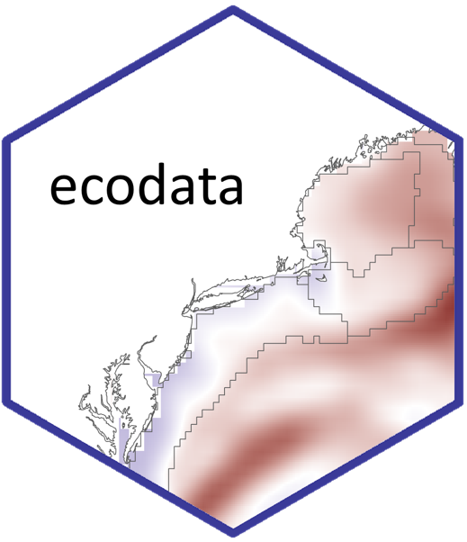

<!-- README.md is generated from README.Rmd. Please edit that file -->

```{r, include = FALSE}
knitr::opts_chunk$set(
  collapse = TRUE,
  comment = "#>",
  fig.path = "man/figures/README-",
  out.width = "100%"
)
```
# ecodata  

<!-- badges: start -->
[](https://github.com/NOAA-EDAB/ecodata/actions/workflows/secretScan.yml)
<!-- badges: end -->

## Overview

`ecodata` is an R data package developed by the Ecosystems Dynamics and Assessment Branch of the Northeast Fisheries Science Center
for use in State of the Ecosystem (SOE) reporting. SOE reports are high-level overviews of ecosystem indicator status and trends occurring
on the Northeast Continental Shelf. Unless otherwise stated, data are representative of specific Ecological Production Units (EPUs), referring to 
the Mid-Atlantic Bight (MAB), Georges Bank (GB), Gulf of Maine (GOM), and Scotian Shelf (SS). SOE reports are developed for US Fishery
Management Councils (FMCs), and therefore indicator data for Scotian Shelf are included when available, but this is not always the case. 

### Please consult the [technical documentation](https://noaa-edab.github.io/tech-doc/) of SOE indicators before using data sets.

## Installation

```{r, eval = F}
remotes::install_github("noaa-edab/ecodata",build_vignettes=TRUE)

# load/attach package
library(ecodata)
```

## Loading data sets

1.  All derived data sets are available once the package has been loaded into the environment. View available data sets using the syntax `ecodata::...`

<p align="center" width="645"> 

</p>


### Legal disclaimer

*This repository is a scientific product and is not official communication of the National Oceanic and Atmospheric Administration, or the United States Department of Commerce. All NOAA GitHub project code is provided on an ‘as is’ basis and the user assumes responsibility for its use. Any claims against the Department of Commerce or Department of Commerce bureaus stemming from the use of this GitHub project will be governed by all applicable Federal law. Any reference to specific commercial products, processes, or services by service mark, trademark, manufacturer, or otherwise, does not constitute or imply their endorsement, recommendation or favoring by the Department of Commerce. The Department of Commerce seal and logo, or the seal and logo of a DOC bureau, shall not be used in any manner to imply endorsement of any commercial product or activity by DOC or the United States Government.*


