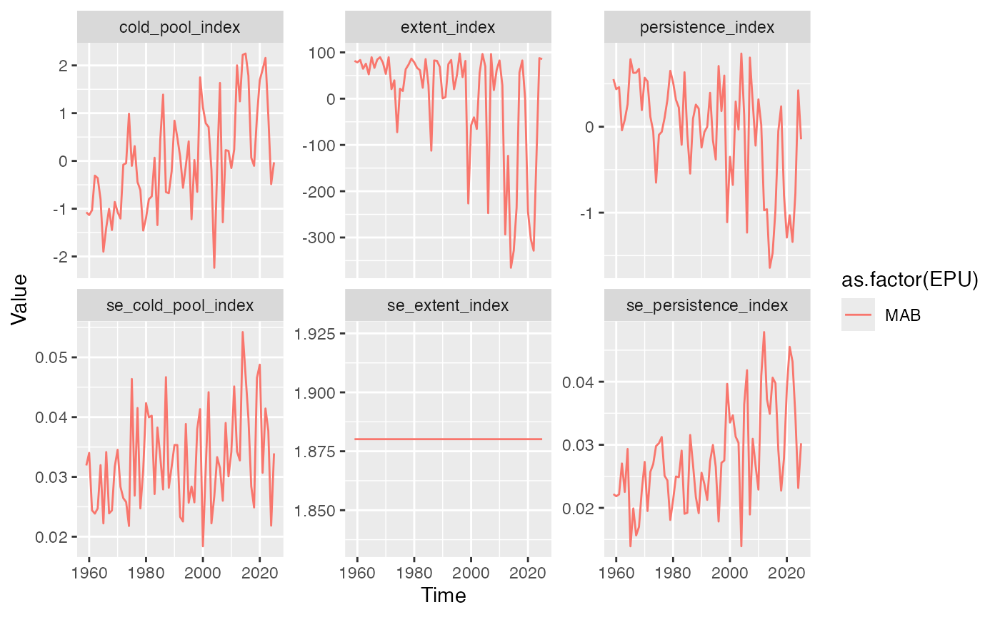
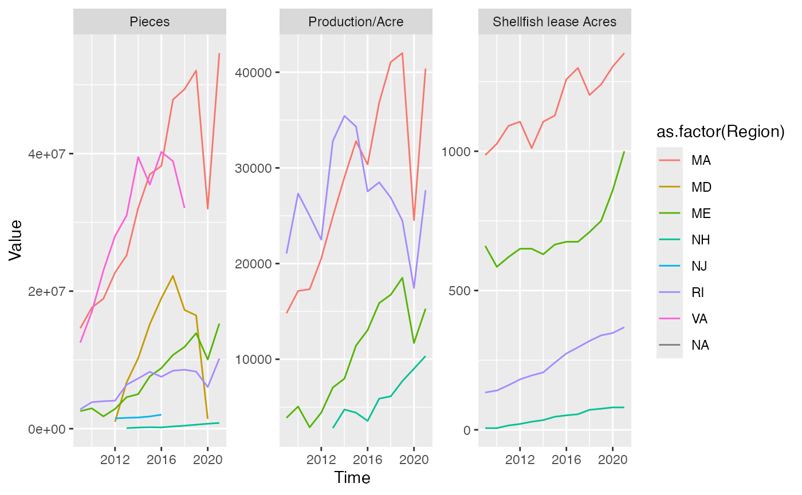
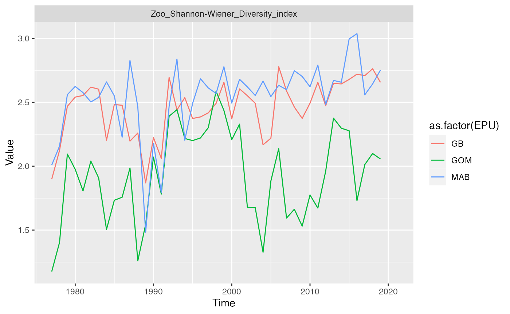

# Introduction to ecodata

Each data set in the `ecodata` package is documented in the
[reference](https://noaa-edab.github.io/reference/) section. Many of the
data sets have a similar structure. They are in long format and
`ggplot2` can be used to quickly view them.

For figures as seen in the SOE reports please visit the [indicator
catalog](https://noaa-edab.github.io/catalog/)

## Cold pool index data

``` r

ggplot(data = ecodata::cold_pool) +
  geom_line(aes(x=Time,y=Value,color=as.factor(EPU))) +
  facet_wrap(vars(Var),scales = "free_y")
```



## Acuaculture data

``` r

ggplot(data = ecodata::aquaculture) +
  geom_line(aes(x=Time,y=Value,color=as.factor(Region))) +
  facet_wrap(vars(Var),scales = "free_y")
```



## Zooplankton diversity index

``` r

ggplot(data = ecodata::zoo_diversity) +
  geom_line(aes(x=Time,y=Value,color=as.factor(EPU))) +
  facet_wrap(vars(Var),scales = "free_y")
```


