## Introduction
The purpose of this report is to document State of the Ecosystem (SOE) indicator data processing. All R code used to process and visualize the following data sets is self-contained in the [Rmarkdown document](https://github.com/NOAA-EDAB/soe/blob/master/inst/Rmd/process_raw.Rmd) associated with this HTML file. To run and update data sets in this document, set the `save_clean` parameter in the set-up chunk to `TRUE`. Raw data for these indicators are available in the file directory `soe/inst/extdata`.


```css
pre code, pre, code {
  white-space: pre !important;
  overflow-y: scroll !important;
  word-break: keep-all !important;
  word-wrap: initial !important;
  max-height: 400px;
}
```


<style type="text/css">
pre code, pre, code {
  white-space: pre !important;
  overflow-y: scroll !important;
  word-break: keep-all !important;
  word-wrap: initial !important;
  max-height: 400px;
}
</style>


## Data sets

### Surface winds {.tabset .tabset-fade}

These data are sourced from the [NCEP North American Regional Reanalysis (NARR)](https://www.esrl.noaa.gov/psd/data/gridded/data.narr.monolevel.html), extending from January 1979 to September 2018. 

<table class="table table-striped" style="width: auto !important; margin-left: auto; margin-right: auto;">
<caption>Variables in "NCEP NARR surface wind; TKE; HLCY, monthly, 1979-2018, V1.csv"</caption>
 <thead>
  <tr>
   <th style="text-align:left;"> Variable </th>
   <th style="text-align:left;"> Name </th>
   <th style="text-align:left;"> Units </th>
  </tr>
 </thead>
<tbody>
  <tr>
   <td style="text-align:left;"> Wind speed </td>
   <td style="text-align:left;"> uwnd </td>
   <td style="text-align:left;width: 5cm; "> m sec^-1^ </td>
  </tr>
  <tr>
   <td style="text-align:left;"> Wind direction </td>
   <td style="text-align:left;"> vwnd </td>
   <td style="text-align:left;width: 5cm; "> ° </td>
  </tr>
  <tr>
   <td style="text-align:left;"> Turbulent kinetic energy </td>
   <td style="text-align:left;"> tke </td>
   <td style="text-align:left;width: 5cm; "> J kg^-1^ </td>
  </tr>
  <tr>
   <td style="text-align:left;"> Storm relative helicity </td>
   <td style="text-align:left;"> hlcy </td>
   <td style="text-align:left;width: 5cm; "> m^2^sec^-2^ </td>
  </tr>
</tbody>
</table>


Variables included in these data are surface wind speed and direction (*uwnd* and *vwnd* respectively), surface turbulent kinetic energy (TKE), and storm relative helicity (HLCY). An indicator for total wind speed is calculated below as
$$\textrm{TWS} = \sqrt{u^2 + v^2}$$. Data are visualized seasonally (Fall = October, November, December; Winter = January, February, March; Spring = April, May, June; Summer = July, August, September).

**Filename**: NCEP NARR surface wind; TKE; HLCY, monthly, 1979-2018, V1.csv  
**Contributor**: Vincent Saba, (vincent.saba@noaa.gov)

#### Processing


```r
# Read in raw data
d <- read.csv(file.path(raw.dir,"NCEP NARR surface wind; TKE; HLCY, monthly, 1979-2018, V1.csv"))

# Processing steps for all wind speed data
wind_clean1 <- d  %>% gather(., Var, Value, GB.uwnd:MAB.tke) %>% #convert wide to long
  dplyr::rename(Time = Month.Year) %>% #rename time variable
  separate(Var, c("EPU","Var"),"\\.") %>% #separate out EPU from variable names
    mutate(Time = dmy(.$Time), #Convert to date format
         Units = plyr::mapvalues(Var, from = unique(Var), to = c(rep("J/kg",2),"m^2/sec^2","J/kg")), #add units
         Time, season = plyr::mapvalues(month(Time), from = seq(1,12,1), #Get season
                                         to = c(rep("winter",3),
                                                rep("spring",3),
                                                rep("summer",3),
                                                rep("fall",3)))) 


# Calculate total wind speed from u and v components
total_wind_speed <- wind_clean1 %>% 
  filter(Var == "uwnd"| Var == "vwnd") %>% #select variables
  spread(., Var, Value) %>% #convert to wide for calculating tws
  mutate(`total wind speed` = sqrt(uwnd^2 + vwnd^2)) %>%  #tws
  dplyr::select(-uwnd, -vwnd) %>% #start processing back to SOE format
  gather(.,Var, Value, `total wind speed`) #convert to long

wind_clean <- rbind(wind_clean1, total_wind_speed)
wind_clean <- wind_clean %>%
  unite(., Var, c(Var, season), sep = " ") %>% #merge season into Var column
  group_by(Time = year(Time), EPU, Var, Units) %>% 
  dplyr::summarise(Value = mean(Value)) %>% 
  as.data.frame()

if (save_clean){
save(wind_clean, file =
       file.path(clean.dir, "wind_clean.Rdata"))
}
```

#### MAB Total Wind Speed

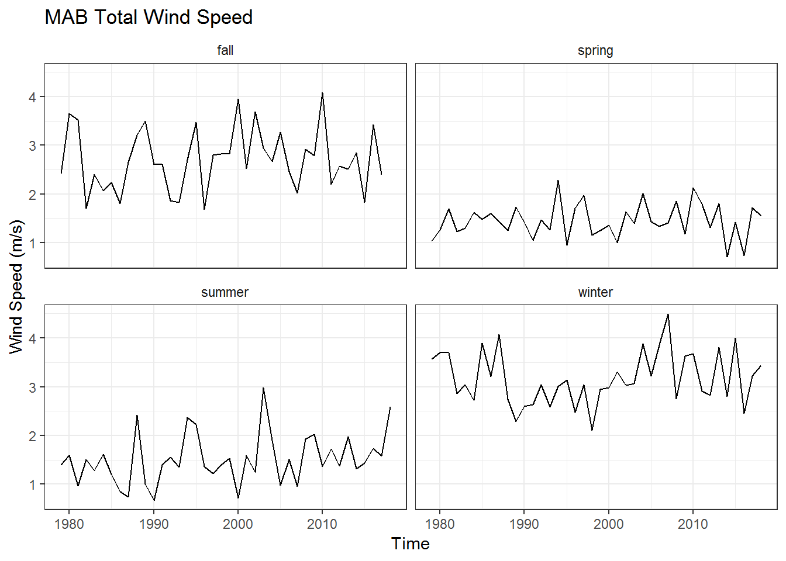

#### GB Total Wind Speed


#### GOM Total Wind Speed


#### MAB Helicity


#### GB Helicity


#### GOM Helicity


#### MAB TKE


#### GB TKE


#### GOM TKE


### Slopewater proportions {.tabset .tabset-fade}

Slopewater proportions give the percent total of water type observed in the deep Northeast Channel (150-200 m depth). 

<table class="table table-striped" style="width: auto !important; margin-left: auto; margin-right: auto;">
<caption>Variables in "slopewater_proportions.csv"</caption>
 <thead>
  <tr>
   <th style="text-align:left;"> Variable </th>
   <th style="text-align:left;"> Names </th>
   <th style="text-align:left;"> Units </th>
  </tr>
 </thead>
<tbody>
  <tr>
   <td style="text-align:left;"> Warm Slope Water proportion </td>
   <td style="text-align:left;width: 5cm; "> WSW </td>
   <td style="text-align:left;"> unitless </td>
  </tr>
  <tr>
   <td style="text-align:left;"> Labrador Shelf Slope Water proportion </td>
   <td style="text-align:left;width: 5cm; "> LSLW </td>
   <td style="text-align:left;"> unitless </td>
  </tr>
</tbody>
</table>

Raw data fields correspond to year, water mass flavor (WSW = Warm Slope Water, LSLW = Labrador Slope Water), and proportion of total expressed as a percentage. 

**Filename**: slopewater_proportions.csv  
**Contributor**: Paula Fratantoni (paula.fratantoni@noaa.gov)

#### Processing


```r
d <- read.csv(file.path(raw.dir,"slopewater_proportions.csv"))

slopewater <- d %>%
  dplyr::rename(Time = year, Var = water.mass.flavor, Value = prop) %>% 
  mutate(EPU = "GOM", Units = "unitless", Var2 = "proportion ne channel") %>% 
  unite(.,Var,c(Var,Var2), sep = " ")

if (save_clean){
save(slopewater, file =
       file.path(clean.dir, "slopewater_proportions.Rdata"))
}
```

#### Visualization


```r
slopewater %>% 
  mutate(Var, Var = plyr::mapvalues(Var, from = c("WSW proportion ne channel",
                                                  "LSLW proportion ne channel"),
                                    to = c("WSW","LSLW"))) %>% 
  dplyr::rename(Flavor  = Var) %>% 
ggplot() +
  geom_line(aes(x = Time, y = Value, color = Flavor))+
  geom_point(aes(x = Time, y = Value, color = Flavor)) +
  ylab("Percent of Total Slopewater") +
  ggtitle("Slopewater Proportions in NE Channel")+
  theme_bw()+
  theme(strip.background = element_blank())
```

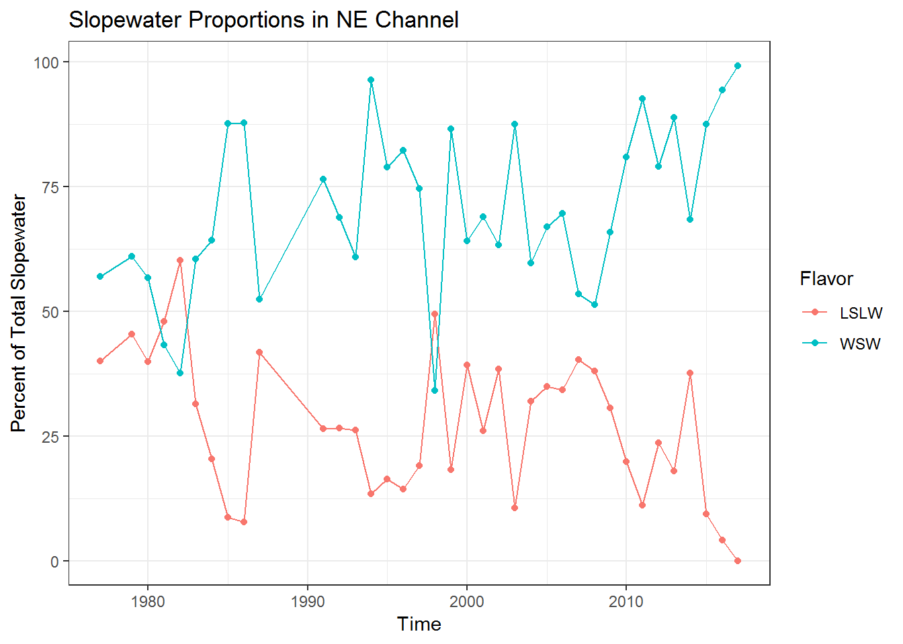


### Ocean temperature anomaly (in situ) {.tabset .tabset-fade}

These data include *in situ* regional time series of both surface and bottom water temperature anomalies on the Northeast Continental Shelf. Raw data is split into four files by EPU (SS, GOM, GB, and MAB).

<table class="table table-striped" style="width: auto !important; margin-left: auto; margin-right: auto;">
<caption>Variables in "Eco{EPU}_core_Ttopbot.csv"</caption>
 <thead>
  <tr>
   <th style="text-align:left;"> Variable </th>
   <th style="text-align:left;"> Names </th>
   <th style="text-align:left;"> Units </th>
  </tr>
 </thead>
<tbody>
  <tr>
   <td style="text-align:left;"> SST anomaly </td>
   <td style="text-align:left;"> Tsfc_anom </td>
   <td style="text-align:left;width: 5cm; "> °C </td>
  </tr>
  <tr>
   <td style="text-align:left;"> Reference SST (1981-2010) </td>
   <td style="text-align:left;"> Tsfc_ref </td>
   <td style="text-align:left;width: 5cm; "> °C </td>
  </tr>
  <tr>
   <td style="text-align:left;"> Bottom temp. anomaly </td>
   <td style="text-align:left;"> Tbot_anom </td>
   <td style="text-align:left;width: 5cm; "> °C </td>
  </tr>
  <tr>
   <td style="text-align:left;"> Reference BT (1981-2010) </td>
   <td style="text-align:left;"> Tbot_ref </td>
   <td style="text-align:left;width: 5cm; "> °C </td>
  </tr>
</tbody>
</table>

**Filenames**: EcoSS_core_Ttopbot.csv, EcoGoM_core_Ttopbot.csv, EcoGB_core_Ttopbot.csv, EcoMAB_core_Ttopbot.csv  
**Contributor**: Paula Fratantoni (paula.fratantoni@noaa.gov)

#### Processing


```r
ss <- read.csv(file.path(raw.dir,"EcoSS_core_Ttopbot.csv")) %>% mutate(EPU = "SS")
gom <- read.csv(file.path(raw.dir,"EcoGoM_core_Ttopbot.csv")) %>% mutate(EPU = "GOM")
gb <- read.csv(file.path(raw.dir,"EcoGB_core_Ttopbot.csv")) %>% mutate(EPU = "GB")
mab <- read.csv(file.path(raw.dir,"EcoMAB_core_Ttopbot.csv")) %>% mutate(EPU = "MAB")

ocean_temp_insitu <- rbind(ss, gom, gb, mab) %>% #bind all
  dplyr::rename(Time = decimal.year, Var = variable.name, Value = temperature) %>% #rename
  mutate(Units = "degreesC", Time = as.Date(format(date_decimal(Time), "%Y-%b-%d"), "%Y-%b-%d"),
         Var, Var = plyr::mapvalues(Var, from = c("Tsfc_anom",#Rename variables
                             "Tsfc_ref",
                             "Tbot_anom",
                             "Tbot_ref"),
                             to = c("sst anomaly in situ",
                                "reference sst in situ (1981-2010)",
                                "bottom temp anomaly in situ",
                                "reference bt in situ (1981-2010)"))) %>% 
  group_by(Time = year(Time), EPU, Var, Units) %>%
  dplyr::summarise(Value = mean(Value)) %>%
  as.data.frame() 

if (save_clean){
save(ocean_temp_insitu, file =
       file.path(clean.dir, "ocean_temp_insitu.Rdata"))
}
```

#### Visualization

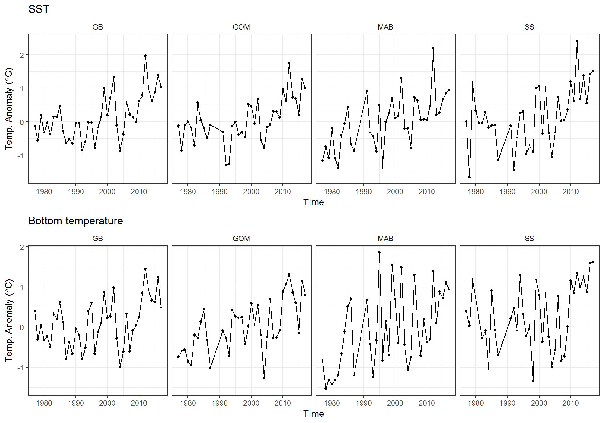


### Ocean temperature (OI) {.tabset}

These data show NE shelf surface and bottom temperatures estimated through an optimal interpolation procedure (see methods [here](https://noaa-edab.github.io/ECSA)). Spring and fall time series were standardized to April 3 and October 11 between the period of 1968-2017. The code below first creates a downsampled raster of each Ecological Production Unit. These downsampled EPU rasters are then used to mask SST and bottom temperature data, from which annual means are computed. This same approach is used to generate time series from EcoMon zooplankton sampling and optimally interpolated salinity data.

**Filename**: temp_bottom_fall_spdf.Rdata, temp_bottom_spring_spdf.Rdata, temp_surface_fall_spdf.Rdata, temp_surface_spring_spdf.Rdata  
**Contributor**: Kevin Friedland (kevin.friedland@noaa.gov)

#### Processing

*Raster manipulation & variable selection functions*


```r
#Read in EPU shapefile (will be downsampled to match raster resolution)
epu <- readOGR(file.path(gis.dir, "EPU_Extended.shp"), verbose = F) 

#Write function to build EPU rasters
build_raster <- function(EPU){
  
  #Filter raster by EPU
  epu <- epu[epu$EPU == EPU,]
  
  #Build empty raster
  r1 <- raster::raster()
  e <- raster::extent(-75.950, -65.450, 35.650, 44.650)
  raster::extent(r1) <- e
  
  #fill with EPU polygon
  r1 <- raster::rasterize(epu, r1, field = 1, fun = mean)
  raster::crs(r1) <- NA
  
  #create raster to resample with
  r2 <- raster::raster(nrow = 90, ncol = 105)
  raster::extent(r2) <- e
  raster::crs(r2) <- NA
  
  #Downsample high res EPU raster to match data
  r.new <- raster::resample(r1, r2, method="bilinear")
  r.new[is.finite(r.new)] <- 1 
  
  return(r.new)
  
}

#Raster data
mab_rast <- build_raster("MAB")
gb_rast <- build_raster("GB")
gom_rast <- build_raster("GOM")

#Process ECSA data by EPU and create time series

epu_env <- function(variable, type = NULL, season, genus = NULL, epu){
  

  if(!is.null(type) & !variable %in% c("salinity","temperature")){
    stop('type only applicable for variables "salinity" and "temperature"
         as type = "bottom" or type = "surface"')
  } 
  
  if(!is.null(genus) & variable != "zooplankton"){
    stop('genus only applicable for variable "zooplankton"')
  } 
  
  #get compiled down-sampled raster of chosen strata from shapefile. 
  epumask.raster <- get(paste0(tolower(epu),"_rast"))
  
  #get bottom temp data and find mean for stock area--------------------------------------
  
  indir <- here("inst","extdata","gridded")
  
  if (variable == "salinity"){
    load(file.path(indir, paste0("sal_",type,"_",season,"_spdf.rdata")))
  } else if (variable == "temperature"){
    load(file.path(indir, paste0("temp_",type,"_",season,"_spdf.rdata")))
  } else if (variable == "chlorophyll"){
    load(file.path(indir, paste0("chl_",season,"_1997-2018.rdata")))
  } else if (variable == "zooplankton"){
    load(file.path(indir, paste0(genus,"_",season,"_zoo_1977-2016.rdata")))
  }
  

    #create null df to fill with results
    data = data.frame(array(NA,dim= c(raster::nlayers(ecsa_dat),5)))
    
    #loops through layers in raster brick
    for(i in 1:raster::nlayers(ecsa_dat)){
      #load raster by year
      
      #get file information from title
      layer_id <- stringr::str_extract(names(ecsa_dat)[[i]], "\\d.*")
      layer_id <- stringr::str_split(layer_id, "_")
      data[i,1] <- layer_id[[1]][[1]]
      data[i,2] <- layer_id[[1]][[2]]
      data[i,3] <- layer_id[[1]][[3]]
      
      #trim to stock area
      masked.raster = ecsa_dat[[i]]*epumask.raster
      
      #find mean BT of stock area
      data[i,4] = raster::cellStats(masked.raster, stat='mean', na.rm=TRUE)
      data[i,5] = raster::cellStats(masked.raster, stat = 'sd', na.rm=TRUE)
      # 
      # if (layer_id[[1]][[1]] == "1995"){
      #   break
      # }
    }
    x <- as.numeric(data$X1)
    y.out <- data$X4
    y.sd <- data$X5
    
    sd.low <- y.out - y.sd
    sd.high <- y.out + y.sd
    
  # remove 
  if (variable == "zooplankton"){
    if (season == "spring"){
      y.out[x %in% c(1989, 1990, 1991, 1994)] <- NA
      sd.low[x %in% c(1989, 1990, 1991, 1994)] <- NA
      sd.high[x %in% c(1989, 1990, 1991, 1994)] <- NA
    } else if (season == "fall") {
      y.out[x %in% c(1989, 1990, 1992)] <- NA
      sd.low[x %in% c(1989, 1990, 1992)] <- NA
      sd.high[x %in% c(1989, 1990, 1992)] <- NA
    }
  }
  
  if(variable == "chlorophyll"){
    type <- ""
  } else if (variable == "zooplankton"){
    type <- genus
    variable <- "zoo"
  } 
  
  out <- data.frame(Var = paste(paste(type,variable),season),
                    Time = as.numeric(x),
                    Value = y.out,
                    sd.low = sd.low,
                    sd.high = sd.high,
                    Season = season,
                    epu = epu)
  
  out <- out[out$Time > 1968,]
  return(out)
  
}
```

*Data pull & aggregation*


```r
#Bottom temperatures
bt_fall_mab <- epu_env(variable = "temperature", type = "bottom", season = "fall", epu = "MAB")
bt_spring_mab <- epu_env(variable = "temperature", type = "bottom", season = "spring", epu = "MAB")

bt_fall_gb <- epu_env(variable = "temperature", type = "bottom", season = "fall", epu = "GB")
bt_spring_gb <- epu_env(variable = "temperature", type = "bottom", season = "spring", epu = "GB")

bt_fall_gom <- epu_env(variable = "temperature", type = "bottom", season = "fall", epu = "GOM")
bt_spring_gom <- epu_env(variable = "temperature", type = "bottom", season = "spring", epu = "GOM")


#Surface temperatures
sst_fall_mab <- epu_env(variable = "temperature", type = "surface", season = "fall", epu = "MAB")
sst_spring_mab <- epu_env(variable = "temperature", type = "surface", season = "spring", epu = "MAB")

sst_fall_gb <- epu_env(variable = "temperature", type = "surface", season = "fall", epu = "GB")
sst_spring_gb <- epu_env(variable = "temperature", type = "surface", season = "spring", epu = "GB")

sst_fall_gom <- epu_env(variable = "temperature", type = "surface", season = "fall", epu = "GOM")
sst_spring_gom <- epu_env(variable = "temperature", type = "surface", season = "spring", epu = "GOM")


bottom_temp_oi <- rbind(bt_fall_mab,
                       bt_spring_mab,
                       bt_fall_gb,
                       bt_spring_gb,
                       bt_fall_gom,
                       bt_spring_gom)

surface_temp_oi <- rbind(sst_fall_mab,
                       sst_spring_mab,
                       sst_fall_gb,
                       sst_spring_gb,
                       sst_fall_gom,
                       sst_spring_gom)

#Start with annual mean, generating sampling uncertainty for this time series is possible
bottom_temp_oi_annual <- bottom_temp_oi %>% 
  group_by(epu, Time) %>% 
  dplyr::summarise(Value = mean(Value)) %>% 
  dplyr::rename(EPU = epu) %>% 
  dplyr::mutate(Units = "degreesC", Var = "bottom temp OI") 
  

#Same thing for annual SST
surface_temp_oi_annual <- surface_temp_oi %>% 
  group_by(epu, Time) %>% 
  dplyr::summarise(Value = mean(Value)) %>% 
  dplyr::rename(EPU = epu) %>% 
  dplyr::mutate(Units = "degreesC", Var = "surface temp OI")

ocean_temp_oi <- rbind(bottom_temp_oi_annual, surface_temp_oi_annual)

if (save_clean){
  save(ocean_temp_oi,file =
       file.path(clean.dir, "ocean_temp_oi.Rdata"))
}
```

#### Visualization

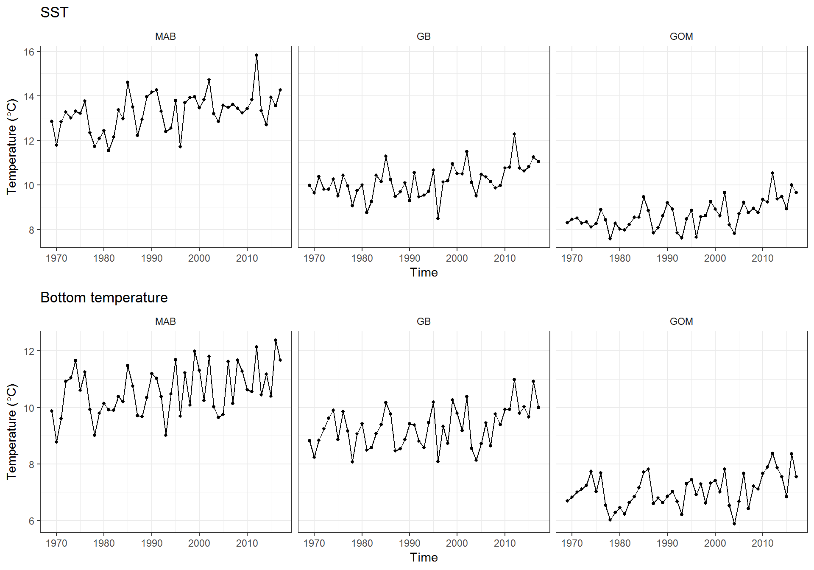

### Ocean salinity anomaly (in situ) {.tabset .tabset-fade}

These data include *in situ* regional time series of both surface and bottom salinity anomalies on the Northeast Continental Shelf. Raw data is split into four files by EPU (SS, GOM, GB, and MAB).

<table class="table table-striped" style="width: auto !important; margin-left: auto; margin-right: auto;">
<caption>Variables in "Eco{EPU}_core_Stopbot.csv"</caption>
 <thead>
  <tr>
   <th style="text-align:left;"> Variable </th>
   <th style="text-align:left;"> Names </th>
   <th style="text-align:left;"> Units </th>
  </tr>
 </thead>
<tbody>
  <tr>
   <td style="text-align:left;"> Surface salinity anomaly </td>
   <td style="text-align:left;width: 5cm; "> Ssfc_anom </td>
   <td style="text-align:left;"> PSU </td>
  </tr>
  <tr>
   <td style="text-align:left;"> Reference surface salinity (1981-2010) </td>
   <td style="text-align:left;width: 5cm; "> Ssfc_ref </td>
   <td style="text-align:left;"> PSU </td>
  </tr>
  <tr>
   <td style="text-align:left;"> Bottom salinity anomaly </td>
   <td style="text-align:left;width: 5cm; "> Sbot_anom </td>
   <td style="text-align:left;"> PSU </td>
  </tr>
  <tr>
   <td style="text-align:left;"> Reference bottom salinity (1981-2010) </td>
   <td style="text-align:left;width: 5cm; "> Sbot_ref </td>
   <td style="text-align:left;"> PSU </td>
  </tr>
</tbody>
</table>

**Filenames**: EcoSS_core_Stopbot.csv, EcoGoM_core_Stopbot.csv, EcoGB_core_Stopbot.csv, EcoMAB_core_Stopbot.csv  
**Contributor**: Paula Fratantoni (paula.fratantoni@noaa.gov)

#### Processing


```r
ss <- read.csv(file.path(raw.dir,"EcoSS_core_Stopbot.csv")) %>% mutate(EPU = "SS")
gom <- read.csv(file.path(raw.dir,"EcoGoM_core_Stopbot.csv")) %>% mutate(EPU = "GOM")
gb <- read.csv(file.path(raw.dir,"EcoGB_core_Stopbot.csv")) %>% mutate(EPU = "GB")
mab <- read.csv(file.path(raw.dir,"EcoMAB_core_Stopbot.csv")) %>% mutate(EPU = "MAB")

ocean_sal_insitu <- rbind(ss, gom, gb, mab) %>% #bind all
  dplyr::rename(Time = decimal.year, Var = variable.name, Value = salinity) %>% #rename
  mutate(Units = "PSU", Time = as.Date(format(date_decimal(Time), "%Y-%b-%d"), "%Y-%b-%d"),
         Var, Var = plyr::mapvalues(Var, from = c("Ssfc_anom",
                             "Ssfc_ref",
                             "Sbot_anom",
                             "Sbot_ref"),
                     to = c("surface salinity anomaly in situ",
                        "reference surface salinity in situ (1981-2010)",
                        "bottom salinity anomaly in situ",
                        "reference bottom salinity in situ (1981-2010)"))) %>% 
  group_by(Time = year(Time), EPU, Var, Units) %>%
  dplyr::summarise(Value = mean(Value)) %>%
  as.data.frame()

if (save_clean){
save(ocean_sal_insitu, file =
       file.path(clean.dir, "ocean_sal_insitu.Rdata"))
}
```

#### Visualization

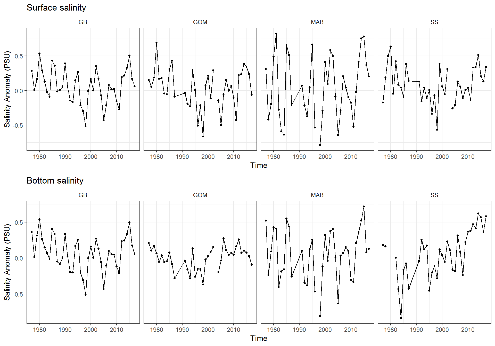

### Ocean salinity (OI) {.tabset .tabset-fade}

These data show optimally interpolated sea-surface and bottom salinities between 1992-2017 (methods for OI procedure are available [here](https://noaa-edab.github.io/ECSA/). Processing of these time series follows the same methods used to process optimally interpolated ocean temperatures. These data are presented as RasterStacks (i.e. one raster layer per year), which are then masked by EPU polygons for further analyses. Here we take the annual mean of masked raster layers to create a time series of OI observations. 

**Filename**: sal_bottom_fall_spdf.Rdata, sal_bottom_spring_spdf.Rdata, sal_surface_fall_spdf.Rdata, sal_surface_spring_spdf.Rdata  
**Contributor**: Kevin Friedland (kevin.friedland@noaa.gov)

#### Processing


```r
#Bottom salinities
bsal_fall_mab <- epu_env(variable = "salinity", type = "bottom", season = "fall", epu = "MAB")
bsal_spring_mab <- epu_env(variable = "salinity", type = "bottom", season = "spring", epu = "MAB")

bsal_fall_gb <- epu_env(variable = "salinity", type = "bottom", season = "fall", epu = "GB")
bsal_spring_gb <- epu_env(variable = "salinity", type = "bottom", season = "spring", epu = "GB")

bsal_fall_gom <- epu_env(variable = "salinity", type = "bottom", season = "fall", epu = "GOM")
bsal_spring_gom <- epu_env(variable = "salinity", type = "bottom", season = "spring", epu = "GOM")


#Surface salinities
ssal_fall_mab <- epu_env(variable = "salinity", type = "surface", season = "fall", epu = "MAB")
ssal_spring_mab <- epu_env(variable = "salinity", type = "surface", season = "spring", epu = "MAB")

ssal_fall_gb <- epu_env(variable = "salinity", type = "surface", season = "fall", epu = "GB")
ssal_spring_gb <- epu_env(variable = "salinity", type = "surface", season = "spring", epu = "GB")

ssal_fall_gom <- epu_env(variable = "salinity", type = "surface", season = "fall", epu = "GOM")
ssal_spring_gom <- epu_env(variable = "salinity", type = "surface", season = "spring", epu = "GOM")


bottom_sal_oi <- rbind(bsal_fall_mab,
                       bsal_spring_mab,
                       bsal_fall_gb,
                       bsal_spring_gb,
                       bsal_fall_gom,
                       bsal_spring_gom)

surface_sal_oi <- rbind(ssal_fall_mab,
                       ssal_spring_mab,
                       ssal_fall_gb,
                       ssal_spring_gb,
                       ssal_fall_gom,
                       ssal_spring_gom)

#Start with annual mean, generating sampling uncertainty for this time series is possible
bottom_sal_oi_annual <- bottom_sal_oi %>% 
  group_by(epu, Time) %>% 
  dplyr::summarise(Value = mean(Value)) %>% 
  dplyr::rename(EPU = epu) %>% 
  dplyr::mutate(Units = "PSU", Var = "bottom sal OI") 
  

#Same thing for annual salinity
surface_sal_oi_annual <- surface_sal_oi %>% 
  group_by(epu, Time) %>% 
  dplyr::summarise(Value = mean(Value)) %>% 
  dplyr::rename(EPU = epu) %>% 
  dplyr::mutate(Units = "PSU", Var = "surface sal OI")

ocean_sal_oi <- rbind(bottom_sal_oi_annual, surface_sal_oi_annual)

if (save_clean){
  save(ocean_sal_oi,file =
       file.path(clean.dir, "ocean_sal_oi.Rdata"))
}
```

#### Visualization

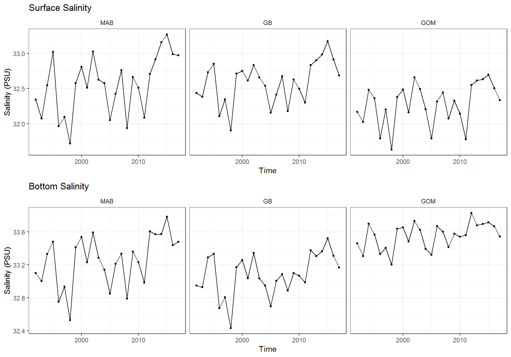


### Stratification {.tabset .tabset-fade}

These data are time series of average stratification (0-50 m depth) by EPU. 

**Filename**: Strat50.csv  
**Contributor**: Paula Fratantoni (paula.fratantoni@noaa.gov)

<table class="table table-striped" style="width: auto !important; margin-left: auto; margin-right: auto;">
<caption>Variables in "Strat50.csv"</caption>
 <thead>
  <tr>
   <th style="text-align:left;"> Variable </th>
   <th style="text-align:left;"> Names </th>
   <th style="text-align:left;"> Units </th>
  </tr>
 </thead>
<tbody>
  <tr>
   <td style="text-align:left;"> stratification </td>
   <td style="text-align:left;width: 5cm; "> stratification </td>
   <td style="text-align:left;"> kg m ^-3^ </td>
  </tr>
</tbody>
</table>

#### Processing


```r
strat <- read.csv(file.path(raw.dir, "Strat50.csv"), stringsAsFactors = FALSE)

stratification <- strat %>% 
  dplyr::rename(Time = time, Var = var, Value = stratification) %>% 
  separate(., Var, c("Var","EPU"), sep = "_") %>% 
  mutate(Var = "stratification (0-50 m)",
         Units = "kg m^-3")

if (save_clean){
  save(stratification, file = file.path(clean.dir, "stratification.Rdata"))
}
```

#### Visualization

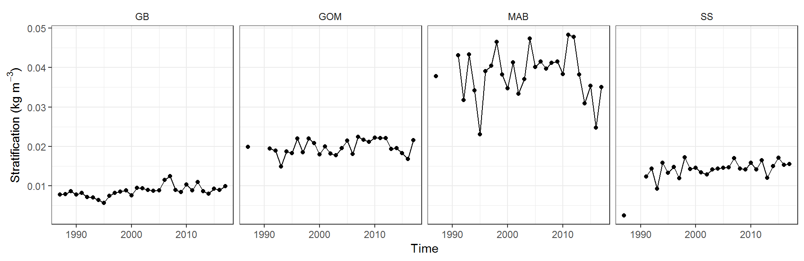


### EcoMon nutrient data {.tabset}

These data include nutrient concentrations, temperature, salinity, density, and dissolved oxygen data sampled via CTD profiles on Ecosystem Monitoring (EcoMon) cruises between 11/3/2009 - 10/19/2016. More metadata are available [here](https://www.nodc.noaa.gov/oads/data/0127524.xml).  
</br>
<div align="center">
<div style="border: 1px solid #ddd; padding: 5px; overflow-y: scroll; height:400px; "><table class="table table-striped" style="width: auto !important; margin-left: auto; margin-right: auto;">
<caption>Variables in "EcoMon Nutrient Data Through June 2018.csv"</caption>
 <thead>
  <tr>
   <th style="text-align:left;"> Variable </th>
   <th style="text-align:left;"> Names </th>
   <th style="text-align:left;"> Units </th>
  </tr>
 </thead>
<tbody>
  <tr>
   <td style="text-align:left;"> Cruise identifier </td>
   <td style="text-align:left;width: 5cm; "> EXPOCODE </td>
   <td style="text-align:left;">  </td>
  </tr>
  <tr>
   <td style="text-align:left;"> Cruise identifier </td>
   <td style="text-align:left;width: 5cm; "> Cruise_ID </td>
   <td style="text-align:left;">  </td>
  </tr>
  <tr>
   <td style="text-align:left;"> Station number </td>
   <td style="text-align:left;width: 5cm; "> STNNBR </td>
   <td style="text-align:left;">  </td>
  </tr>
  <tr>
   <td style="text-align:left;"> CTD cast number </td>
   <td style="text-align:left;width: 5cm; "> CASTNO </td>
   <td style="text-align:left;">  </td>
  </tr>
  <tr>
   <td style="text-align:left;"> Sample bottle number </td>
   <td style="text-align:left;width: 5cm; "> BTLNBR </td>
   <td style="text-align:left;">  </td>
  </tr>
  <tr>
   <td style="text-align:left;"> Sample date </td>
   <td style="text-align:left;width: 5cm; "> Date_UTC </td>
   <td style="text-align:left;"> MM/DD/YYYY </td>
  </tr>
  <tr>
   <td style="text-align:left;"> Sample time </td>
   <td style="text-align:left;width: 5cm; "> Time_UTC </td>
   <td style="text-align:left;"> hh:mm </td>
  </tr>
  <tr>
   <td style="text-align:left;"> Latitude </td>
   <td style="text-align:left;width: 5cm; "> Latitude </td>
   <td style="text-align:left;"> decimal degrees </td>
  </tr>
  <tr>
   <td style="text-align:left;"> Longitude </td>
   <td style="text-align:left;width: 5cm; "> Longitude </td>
   <td style="text-align:left;"> decimal degrees </td>
  </tr>
  <tr>
   <td style="text-align:left;"> Depth of station </td>
   <td style="text-align:left;width: 5cm; "> Depth_station </td>
   <td style="text-align:left;"> m </td>
  </tr>
  <tr>
   <td style="text-align:left;"> Depth of sample </td>
   <td style="text-align:left;width: 5cm; "> Depth_sampling </td>
   <td style="text-align:left;"> m </td>
  </tr>
  <tr>
   <td style="text-align:left;"> Water pressure </td>
   <td style="text-align:left;width: 5cm; "> CTDPRS </td>
   <td style="text-align:left;"> decibars </td>
  </tr>
  <tr>
   <td style="text-align:left;"> Water temperature </td>
   <td style="text-align:left;width: 5cm; "> CTDTEMP </td>
   <td style="text-align:left;"> °C </td>
  </tr>
  <tr>
   <td style="text-align:left;"> Water salinity </td>
   <td style="text-align:left;width: 5cm; "> CTDSAL </td>
   <td style="text-align:left;"> PSS-78 </td>
  </tr>
  <tr>
   <td style="text-align:left;"> Potential density at surface pressure </td>
   <td style="text-align:left;width: 5cm; "> Sigma.Theta </td>
   <td style="text-align:left;"> kg m^-3^ </td>
  </tr>
  <tr>
   <td style="text-align:left;"> Dissolved oxygen </td>
   <td style="text-align:left;width: 5cm; "> CTDOXY </td>
   <td style="text-align:left;"> mg L^-1^ </td>
  </tr>
  <tr>
   <td style="text-align:left;"> Silicic acid concentration </td>
   <td style="text-align:left;width: 5cm; "> SILCAT </td>
   <td style="text-align:left;"> $\mu$M </td>
  </tr>
  <tr>
   <td style="text-align:left;"> Total nitrate and nitrite concentration </td>
   <td style="text-align:left;width: 5cm; "> NITRIT+NITRAT </td>
   <td style="text-align:left;"> $\mu$M </td>
  </tr>
  <tr>
   <td style="text-align:left;"> Ammonia concentration </td>
   <td style="text-align:left;width: 5cm; "> AMMMONIA </td>
   <td style="text-align:left;"> $\mu$M </td>
  </tr>
  <tr>
   <td style="text-align:left;"> Phosphate concentration </td>
   <td style="text-align:left;width: 5cm; "> PHSPHT </td>
   <td style="text-align:left;"> $\mu$M </td>
  </tr>
  <tr>
   <td style="text-align:left;"> Dissolved oxygen </td>
   <td style="text-align:left;width: 5cm; "> CTDOXYMOL </td>
   <td style="text-align:left;"> $\mu$mol kg^-1^ </td>
  </tr>
</tbody>
</table></div>
</div>  
</br>
**Filename**: EcoMon Nutrient Data Through June 2018.csv  
**Contributor**: Chris Melrose (chris.melrose@noaa.gov)  

#### Processing


```r
d <- read.csv(file.path(raw.dir,"EcoMon Nutrient Data Through June 2018.csv"), stringsAsFactors = FALSE)

#Create data frame for mapping units to variable names
mapping <- data.frame(Units = as.character(d[1,]),
                      Var = as.character(names(d)))
mapping[mapping$Units == "" | mapping$Units == "NA",]$Units <- NA

#remove row with units
d <- slice(d,-1)

d1 <- d %>% 
  mutate(Time = Date_UTC) %>% #create Time variable
  dplyr::select(-Date_UTC,-Time_UTC) %>% #remove time, date
  gather(., Var, Value, -Latitude, -Longitude, -Time, -Depth_sampling, -Depth_station) %>% #turn wide to long while retaining lat/lon
  filter(!is.na(Value)) %>% #remove NA
  left_join(., mapping, by = c("Var")) %>% #join units 
  mutate(Longitude = as.numeric(Longitude),
         Latitude = as.numeric(Latitude),
         Time = mdy(Time)) %>% 
  filter(Latitude > 32, Latitude<50)


#Sanity check
# t1 <- d1[d1$Var == "CTDOXYMOL" ,]$Value
# t <-  d %>% slice(.,-1)
# t <- as.character(t$CTDOXYMOL)
# all(t == t1)

#Read in EPU shapefile
epu <- readOGR(file.path(gis.dir, "EPU_Extended.shp"), verbose = F) 
epu <- as(epu, "sf") #convert to sf object

if(spatial_processing){

  #Test maps
  #All EPUs
  #ggplot() + geom_sf(data = epu)
  
  #Scotian shelf
  # ss <- epu %>% filter(EPU == "SS")
  # ggplot() + geom_sf(data = ss)
  
  #get latitude and longitude for creating SpatialPointsDataFrame
  lat <-  as.numeric(d$Latitude)
  lon <- as.numeric(d$Longitude)
  coords <- data.frame(lon = lon,lat = lat)
  
  #create spdf
  spdf <- SpatialPointsDataFrame(coords = coords, data = coords,
                                 proj4string = CRS(crs))
  #convert to sf
  coords_sf <- st_as_sf(spdf) 
  
  #get intersection for mapping EPUs back to nutrient data
  epu_intersect <- st_intersection(epu, coords_sf)
  #plot(epu_intersect[epu_intersect$EPU == "MAB",])
  
  #Map back to nutrient data frame
  epu_df <- data.frame(Longitude = epu_intersect$lon,
                       Latitude = epu_intersect$lat,
                       EPU = epu_intersect$EPU)
  #join
  NE_LME_nutrients <- d1 %>% 
    left_join(.,epu_df, by = c("Latitude","Longitude"))
  
  #Select data for plotting 
  Nitr <- NE_LME_nutrients %>% filter(Var == "NITRIT.NITRAT")
  
  #Back to SOE format and specify bottom, mid-water, or surface sampling
  NE_LME_nutrients <- NE_LME_nutrients %>%
    dplyr::select(-Latitude, -Longitude) %>% 
    mutate(Value = as.numeric(Value),
           Depth_station = as.numeric(Depth_station),
           Depth_sampling = as.numeric(Depth_sampling)) %>% 
    mutate(bot_dif = Depth_station-Depth_sampling) %>% 
    mutate(surf_bot = ifelse(bot_dif <= 10, "bottom",
                           ifelse(bot_dif > 10 & Depth_sampling <= 5, "surface", "mid-water"))) %>% 
    filter(Value > 0, !is.na(EPU), !Var %in% c("BTLNBR","CASTNO","Depth_sampling",
                                             "Depth_station","STNNBR")) %>% 
    mutate(Var = paste(Var, surf_bot)) %>% 
    dplyr::select(Time, Var, Value, Units, EPU) %>% 
    group_by(EPU, Time = year(Time), Var, Units) %>% 
    dplyr::summarise(Value = mean(Value, na.rm = TRUE)) %>% 
    as.data.frame()
  
  if (save_clean){
    save(NE_LME_nutrients,file = file.path(clean.dir, "EcoMon_nutrients.Rdata"))
  }
} else {
  load(file.path(sample.dir,"sample_nutrients.Rdata"))
  load(file.path(clean.dir,"EcoMon_nutrients.Rdata"))
}
```

#### QA

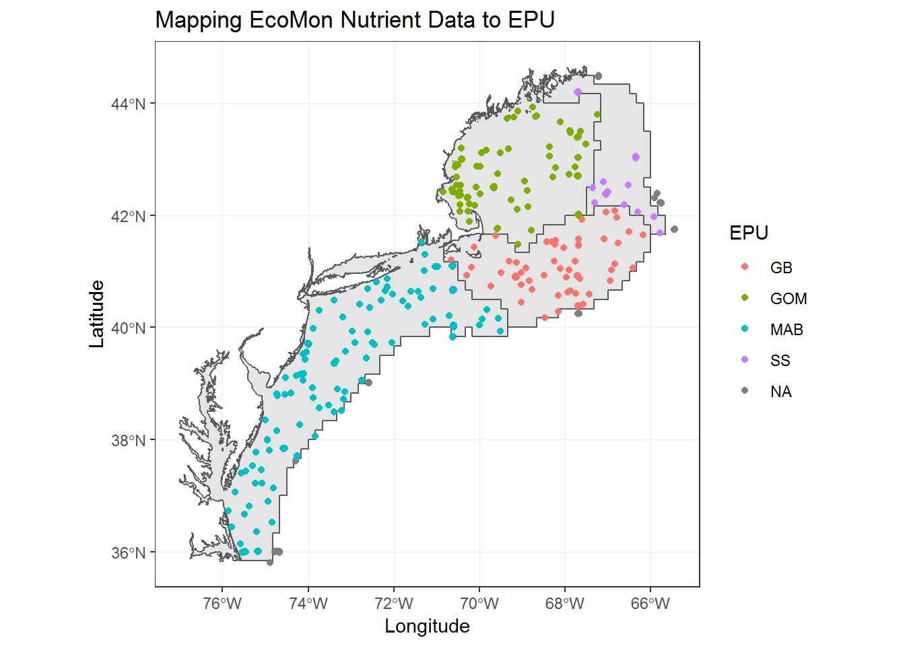


#### Surface Nutrients

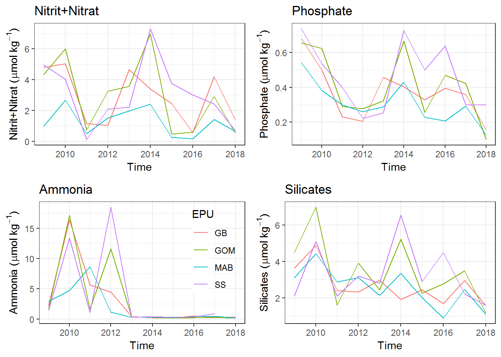

#### Bottom Nutrients

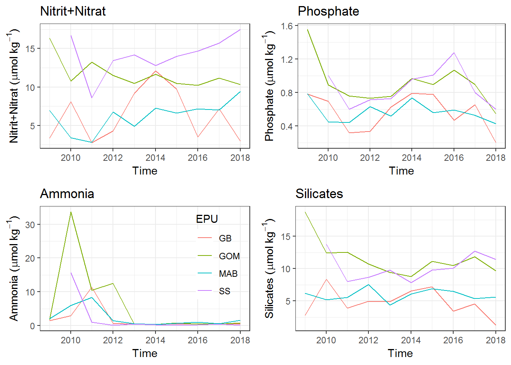

### North Atlantic Oscillation (NAO) {.tabset}

North Atlantic Oscillation data were taken from the [NOAA NWS Climate Prediction Center](http://www.cpc.ncep.noaa.gov/data/teledoc/nao.shtml). These data show the monthly NAO index time series beginning in 1950 and ending in October 2018. The index is standardized to the 1981-2010 reference period. More information regarding the methodology involved in deriving the NAO and its significance is available [here](http://www.cpc.ncep.noaa.gov/data/teledoc/nao.shtml).

#### Processing


```r
d <- read.csv(file.path(raw.dir, "NAO_index_1950-Oct2018.csv")) %>% slice(.,-826:-825)

#Three month running average
nao_cpc <- d %>% 
  mutate(Time = paste0(YEAR,":Q",rep(1:4, each = 3))) %>% 
  group_by(Time) %>% 
  dplyr::summarise(Value = mean(INDEX)) %>% 
  mutate(Var = "nao index", units = "unitless", EPU = "all",
         Time = yq(Time))

#annual average
nao_annual <- d %>% 
  group_by(YEAR) %>% 
  dplyr::summarise(Value = mean(INDEX),
                   Variance = var(INDEX)) %>% 
  mutate(Var = "nao index", Units = "unitless", EPU = "all") %>% 
  dplyr::rename(Time = YEAR)

if (save_clean){
  nao <- nao_annual %>% select(-Variance) 
  save(nao, file = file.path(clean.dir, "nao_annual.Rdata"))
}
```

#### NAO index and index variance (Annual)

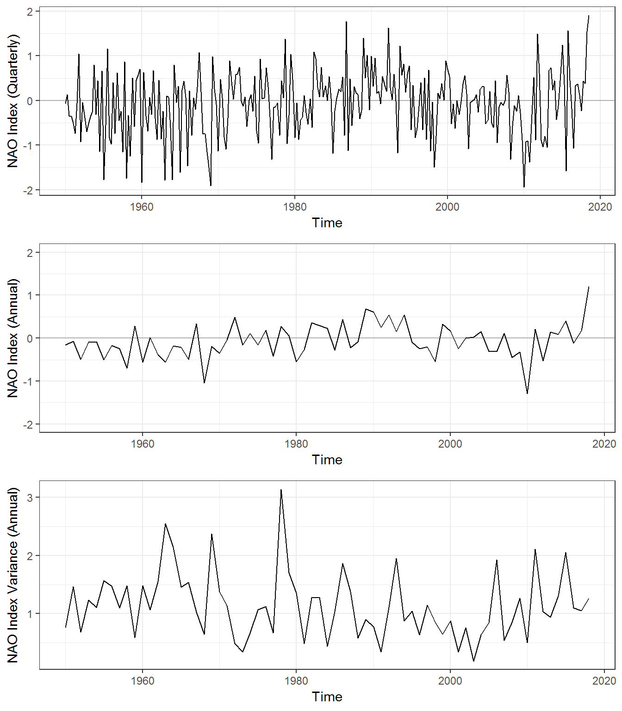


## Synthesis  

### Visualize Series & Build Correlation Matrices {.tabset}

#### Visualization App

<iframe src="https://seanhardison.shinyapps.io/soe-shiny/?showcase=0" width="672" height="500px"></iframe>


#### Methods
The purpose of this application is for users to familiarize themselves with available indicator data sets. Biases introduced by small sample sizes are not considered in the correlation matrices, and so these visualizations should only be considered an exploratory analysis.  

To create correlation matrices, we first developed a function (shown below) to normalize and assess each time series for stationarity using the Augmented Dickey Fuller (ADF) test. If a time series were found to be non-stationary, we applied a first-order differencing step before assessing for stationarity again. If upon the second ADF test the series was still shown to be non-stationarity, it was not included in further correlation analyses rather than applying higher order differencing. This step was taken to prevent over-differencing of series. Group structure in correlation matrices was defined by the magnitude of the scaled and centered first principal component. 


```r
#Normalization and differencing function

get_dat <- function(field){
  #Split out data
  time <- env[env$Var == field,]$Time
  end <- max(time)
  time <- time[1:which(time == end)]
  Value <- env[env$Var == field,]$Value
  
  if (all(is.na(as.numeric(Value))) | sd(Value, na.rm = T) == 0){
    Value <- NA #Assign as NA if not including
  } else {
    
    Value <- Value[1:length(time)]
    Value <- (Value-mean(Value, na.rm = TRUE))/sd(Value, na.rm = TRUE) #normalize
    
    #interpolate missing values
    if (any(is.na(Value))){
      Value <- approx(time, Value, n = length(Value))$y
    }
    
    #test for stationarity with Augmented Dickey Fuller
    adf <- suppressWarnings(adf.test(Value)$p.value)
    
    if (adf > 0.05){ #if non-stationary take first difference and use residuals
      mod <- arima(Value, order = c(0,1,0))
      Value <- resid(mod)
      
      adf2 <- suppressWarnings(adf.test(Value)$p.value) #check again for stationarity
      if (adf2 > 0.05){
        Value <- NA #if still non-stationary, make NA for exclusion
      }
      
    }
    
  }
  out <- data.frame(var = field,
                    value = as.numeric(Value),
                    time = time)
  return(out)
}
```

  
