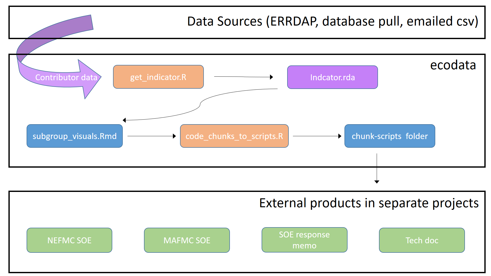

```{r, echo=FALSE}
library(magrittr)
```


## Overview

[**`ecodata`**](https://github.com/NOAA-EDAB/ecodata) is an R data package developed by the [Ecosystem Dynamics and Assessment Branch of the Northeast Fisheries Science Center](https://www.fisheries.noaa.gov/new-england-mid-atlantic/ecosystems/northeast-ecosystem-dynamics-and-assessment-our-research) for use in State of the Ecosystem (SOE) reporting.

## Background

<div style= "float:right;position: relative; top: 20px;">
| DOIs |
| --- |
| [MAFMC SOE 2020](https://doi.org/10.25923/1f8j-d564) |
| [NEFMC SOE 2020](https://doi.org/10.25923/4tdk-eg57) |
| [Technical Documentation SOE 2020](https://doi.org/10.25923/64pf-sc70) |
| [MAFMC SOE 2021](https://repository.library.noaa.gov/view/noaa/29525) |
| [NEFMC SOE 2021](https://repository.library.noaa.gov/view/noaa/29524) |
| [Technical Documentation SOE 2021](https://repository.library.noaa.gov/view/noaa/29277) |
| [MAFMC SOE 2022](https://doi.org/10.25923/5s5y-0h81) |
| [NEFMC SOE 2022](https://doi.org/10.25923/ypv2-mw79) |
| [Technical Documentation SOE 2022](https://doi.org/10.25923/xq8b-dn10) |
</div>

The State of the Ecosystem reports are high-level overviews of ecosystem indicator status and trends occurring on the Northeast Continental Shelf. They are apart of a larger [Integrated Ecosystem Assessmnet (IEA)](https://www.integratedecosystemassessment.noaa.gov/regions/northeast) approach to ecosystem based management.  The SOE reports are developed for US Fishery Management Councils (FMCs) in New England and the Mid-Atlantic. DOIs for SOEs and related documents are found in the table to the right. 


## How it works

The schematic below shows the workflow from contributor data submission to developing the State of the Ecosystem and other products. The data, once contributed, is cleaned to ensure the data is in the correct format. These `indicator.rda` datasets are used to create draft visualizations in categorized subgroup_visuals.Rmd. The subgroups include [Low Trophic/Climate/Habitat Mid-Atlantic Bight](https://noaa-edab.github.io/ecodata/LTL_MAB), [Low Trophic/Climate/Habitat New England](https://noaa-edab.github.io/ecodata/LTL_NE), [Macrofauna Mid-Atlantic Bight](https://noaa-edab.github.io/ecodata/macrofauna_MAB),  [Macrofauna New England](https://noaa-edab.github.io/ecodata/macrofauna_NE), [Human Dimensions Mid-Atlantic Bight](https://noaa-edab.github.io/ecodata/human_dimensions_MAB), and [Human Dimensions New England ](https://noaa-edab.github.io/ecodata/human_dimensions_NE). The code used to create these visuals is stored so it can be grabbed for use in the State of the Ecosystem reports and other products (Technical Documentation, presentations, etc.).  

```{r, eval=TRUE, echo=FALSE, message=FALSE, warning=FALSE}
#
```


## What is included 

Each annual report cycle is developed with new and updated datasets. Guidelines for formatting data for the State of the Ecosystem reports are [linked here](https://noaa-edab.github.io/ecodata/data_guidelines). This table shows which versions of all related products correspond to a specific State of the Ecosystem report cycle. 


| Year | Audience  | State of the Ecosystem | Response Memo | ecodata | Technical Documentation |
|------|------------------|-------------|----------------|--------------|------------------|
| 2019 | MAMFC | [0.1.0](https://github.com/NOAA-EDAB/SOE-NEFMC/tree/v0.1.0) | NA | [0.1.0](https://github.com/NOAA-EDAB/ecodata/tree/0.1.0) | [1.0.0](https://github.com/NOAA-EDAB/tech-doc/tree/v1.0.0)  |
| 2019 | MAFMC | [0.1.1](https://github.com/NOAA-EDAB/SOE-MAFMC/tree/v0.1.1) | NA| [0.1.0](https://github.com/NOAA-EDAB/ecodata/tree/0.1.0) | [1.0.0](https://github.com/NOAA-EDAB/tech-doc/tree/v1.0.0)  |
| 2019 | NEMFC | [0.1.0](https://github.com/NOAA-EDAB/SOE-NEFMC/tree/v0.1.0) | NA | [0.1.0](https://github.com/NOAA-EDAB/ecodata/tree/0.1.0) | [1.0.0](https://github.com/NOAA-EDAB/tech-doc/tree/v1.0.0)  |
| 2019 | NEFMC | [0.1.1](https://github.com/NOAA-EDAB/SOE-NEFMC/tree/v0.1.1) | NA | [0.1.0](https://github.com/NOAA-EDAB/ecodata/tree/0.1.0) | [1.0.0](https://github.com/NOAA-EDAB/tech-doc/tree/v1.0.0)  |
| 2020 | Internal Review MAFMC SOE | [2020.0.0](https://github.com/NOAA-EDAB/SOE-MAFMC/tree/2020.0.0) | [2020.0.0](https://github.com/NOAA-EDAB/memos/tree/2020.1.0) | [1.0.0](https://github.com/NOAA-EDAB/ecodata/tree/1.0.0) | [2.0.0](https://github.com/NOAA-EDAB/tech-doc/tree/2.0.0)
| 2020 | Internal Review NEFMC SOE | [2020.0.0](https://github.com/NOAA-EDAB/SOE-NEFMC/tree/2020.0.0) | [2020.0.0](https://github.com/NOAA-EDAB/memos/tree/2020.1.0) | [1.0.0](https://github.com/NOAA-EDAB/ecodata/tree/1.0.0) | [2.0.0](https://github.com/NOAA-EDAB/tech-doc/tree/2.0.0)
| 2020 | MAFMC SSC | [2020.1.0](https://github.com/NOAA-EDAB/SOE-MAFMC/tree/2020.1.0) | [2020.0.0](https://github.com/NOAA-EDAB/memos/tree/2020.0.0) | [1.0.0](https://github.com/NOAA-EDAB/ecodata/tree/1.0.0) | [2.0.0](https://github.com/NOAA-EDAB/tech-doc/tree/2.0.0)
| 2020 | NEFMC SSC | [2020.1.0](https://github.com/NOAA-EDAB/SOE-NEFMC/tree/2020.1.0) | [2020.1.0](https://github.com/NOAA-EDAB/memos/tree/2020.1.0) | [1.0.0](https://github.com/NOAA-EDAB/ecodata/tree/1.0.0) | [2.0.0](https://github.com/NOAA-EDAB/tech-doc/tree/2.0.0) |
| 2020 | MAFMC | [2020.2.0](https://github.com/NOAA-EDAB/SOE-MAFMC/tree/2020.2.0) | [2020.1.0](https://github.com/NOAA-EDAB/memos/tree/2020.1.0) | [1.1.0](https://github.com/NOAA-EDAB/ecodata/tree/1.1.0) | [2.0.0](https://github.com/NOAA-EDAB/tech-doc/tree/2.0.0)
| 2020 | NEFMC | [2020.2.0](https://github.com/NOAA-EDAB/SOE-NEFMC/tree/2020.2.0) | [2020.1.0](https://github.com/NOAA-EDAB/memos/tree/2020.1.0) | [1.1.0](https://github.com/NOAA-EDAB/ecodata/tree/1.1.0) | [2.0.0](https://github.com/NOAA-EDAB/tech-doc/tree/2.0.0) |
| 2021 | Internal Review NAFMC SOE | [2021.0.0](https://github.com/NOAA-EDAB/SOE-NEFMC/releases/tag/2021.0.0) | [2021.1.0](https://github.com/NOAA-EDAB/memos) | [2.0.0](https://github.com/NOAA-EDAB/ecodata/releases/tag/2.0.0) | [2.1.0](https://github.com/NOAA-EDAB/tech-doc/tree/2.1.0) |
| 2021 | Internal Review MAFMC SOE | [2021.0.0](https://github.com/NOAA-EDAB/SOE-MAFMC/releases/tag/2021.0.0) | [2021.1.0](https://github.com/NOAA-EDAB/memos) | [2.0.0](https://github.com/NOAA-EDAB/ecodata/releases/tag/2.0.0) | [2.1.0](https://github.com/NOAA-EDAB/tech-doc/tree/2.1.0) |
| 2021 | NEFMC SSC |[2021.1.0](https://github.com/NOAA-EDAB/SOE-NEFMC/releases/tag/2021.1.0) | [2021.1.0](https://github.com/NOAA-EDAB/memos) | [2.0.0](https://github.com/NOAA-EDAB/ecodata/releases/tag/2.0.0) | [2.1.0](https://github.com/NOAA-EDAB/tech-doc/tree/2.1.0) |
| 2021 | MAFMC SSC |[2021.1.0](https://github.com/NOAA-EDAB/SOE-MAFMC/releases/tag/2021.1.0) | [2021.1.0](https://github.com/NOAA-EDAB/memos) | [2.0.0](https://github.com/NOAA-EDAB/ecodata/releases/tag/2.0.0) | [2.1.0](https://github.com/NOAA-EDAB/tech-doc/tree/2.1.0) |
| 2021 | NEFMC | [2021.2.0](https://github.com/NOAA-EDAB/SOE-NEFMC/releases/tag/2021.2.0) | [2021.1.0](https://github.com/NOAA-EDAB/memos/releases/tag/2021.1.0) | [2.0.0](https://github.com/NOAA-EDAB/ecodata/releases/tag/2.0.0) | [2.1.0](https://github.com/NOAA-EDAB/tech-doc/tree/2.1.0) |
| 2021 | MAFMC | [2021.2.0](https://github.com/NOAA-EDAB/SOE-MAFMC/releases/tag/2021.2.0) | [2021.1.0](https://github.com/NOAA-EDAB/memos/releases/tag/2021.1.0) | [2.0.0](https://github.com/NOAA-EDAB/ecodata/releases/tag/2.0.0) | [2.1.0](https://github.com/NOAA-EDAB/tech-doc/tree/2.1.0) |
| 2021 | NEFMC w/ Protected Species Revisions | [2021.3.0](https://github.com/NOAA-EDAB/SOE-NEFMC/releases/tag/2021.3.0) | [2021.1.0](https://github.com/NOAA-EDAB/memos/releases/tag/2021.1.0) | [2.0.0](https://github.com/NOAA-EDAB/ecodata/releases/tag/2.0.0) | [2.1.0](https://github.com/NOAA-EDAB/tech-doc/tree/2.1.0) | 
| 2021 | MAFMC w/ Protected Species Revisions | [2021.3.0](https://github.com/NOAA-EDAB/SOE-MAFMC/releases/tag/2021.3.0) | [2021.1.0](https://github.com/NOAA-EDAB/memos/releases/tag/2021.1.0) | [2.0.0](https://github.com/NOAA-EDAB/ecodata/releases/tag/2.0.0) | [2.1.0](https://github.com/NOAA-EDAB/tech-doc/tree/2.1.0) | 
|2022 | MAFMC SSC | [2022.1](https://github.com/NOAA-EDAB/SOE-MAFMC/releases/tag/2022.1) | [2022.1](https://github.com/NOAA-EDAB/memos/releases/tag/2022.1) | [3.0](https://github.com/NOAA-EDAB/ecodata/releases/tag/3.0) | [3.0](https://github.com/NOAA-EDAB/tech-doc/tree/3.0) | 
|2022 | NEFMC SSC | [2022.1](https://github.com/NOAA-EDAB/SOE-NEFMC/releases/tag/2022.1) | [2022.1](https://github.com/NOAA-EDAB/memos/releases/tag/2022.1) | [3.0](https://github.com/NOAA-EDAB/ecodata/releases/tag/3.0) | [3.0](https://github.com/NOAA-EDAB/tech-doc/tree/3.0) | 
|2022 | MAFMC | [2022.2](https://github.com/NOAA-EDAB/SOE-MAFMC/releases/tag/2022.2) | [2022.1](https://github.com/NOAA-EDAB/memos/releases/tag/2022.1) | [3.0](https://github.com/NOAA-EDAB/ecodata/releases/tag/3.0) | [3.0](https://github.com/NOAA-EDAB/tech-doc/tree/3.0) | 
|2022 | NEFMC | [2022.2](https://github.com/NOAA-EDAB/SOE-NEFMC/releases/tag/2022.2) | [2022.1](https://github.com/NOAA-EDAB/memos/releases/tag/2022.1) | [3.0](https://github.com/NOAA-EDAB/ecodata/releases/tag/3.0) | [3.0](https://github.com/NOAA-EDAB/tech-doc/tree/3.0) | 

Below is a table outlining the indicators included in `ecodata` and which SOE year the indicator was included in the report(s). Further information for each indicator can be found in the [Technical Documentation: State of the Ecosystem](https://noaa-edab.github.io/tech-doc/). This holds the details on the methodologies used for all indicators included in the reports including those not included in `ecodata`.  


*TABLE requires access to google docs*


